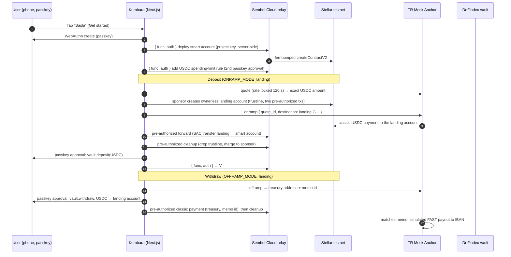

# Kumbara

[](https://github.com/keyboord01/kumbara/actions/workflows/ci.yml)

**Kumbara** is a self-custodial USDC piggy bank on Stellar for Turkish users, by [Sembol](https://github.com/keyboord01/sembol). Open it with a passkey (Face ID, Touch ID or a password manager), load Turkish lira through a regulated anchor, hold USDC in a DeFindex vault, withdraw back to lira. No seed phrase, no XLM, no app store. Testnet today.

Scale Track entry for the Rise In × Stellar Pro Hackathon (Istanbul, 19–20 September 2026) and the traction exhibit for a Stellar Community Fund Build Award (Integration Track) submission.

## What Kumbara is

A Next.js web app. A user opens it on their phone, taps their passkey (Face ID, Touch ID or a password manager), and gets an OpenZeppelin smart account on Stellar with the passkey as its only signer. They deposit lira through a SEP-compliant anchor, receive USDC in that account, the USDC goes into a DeFindex vault, and they can withdraw back to lira through the same anchor. Fees are sponsored by Sembol Cloud, so the user never sees XLM.

Kumbara is non-custodial software. It never holds fiat, never holds keys, never takes custody of USDC. The anchor is the regulated party. Put money in, hold it, take it out to your own bank account or to a Stellar address you choose; no payments product, no merchant flow.

Live on testnet: **https://kumbara.sembol.xyz** (the earlier `kumbara.vercel.app` address redirects here; passkeys created there do not open on the new domain)

## Problem

Saving in dollars is something Turkish households already do, in cash and in bank accounts, against a currency that lost most of its value in five years. The on-chain version, a stablecoin, has been out of reach for anyone who is not already a crypto user: seed phrases, gas tokens, exchange sign-ups, and a wallet UX designed for traders. A piggy bank should be as simple as the one on a child's shelf: put lira in, take lira out, and in between keep it in something that holds its value. That is the whole product.

## How it works



The anchor only pays and watches classic addresses, so each deposit and withdrawal passes through a throwaway classic "landing" account that nobody controls: after setup its only usable authorization is two pre-authorized transactions built for the exact quoted amount. Details, tradeoffs and the threat model are in [`docs/architecture.md`](docs/architecture.md); the measurements are in [`docs/anchor-notes.md`](docs/anchor-notes.md).

Build status: Gates 0–5 are done (spikes, onboard + savings, deposit round trip, withdraw round trip, booth mode + `/api/metrics`, failure screens, round trips in CI, the public `/stats` page, the recorded fallback demo).

## Integrations

- **DeFindex**: the kumbara's USDC is deposited into a DeFindex vault with `invest=true` (`deposit` / `withdraw` / `balance` / `get_asset_amounts_per_shares` on the vault contract), so deposits follow the vault's real invest path into its strategy and withdrawals unwind from it. The testnet vault was deployed through the DeFindex factory for the anchor's USDC with DeFindex's **hodl strategy** attached (their `hodl_strategy` crate, built unmodified and deployed by Kumbara for Circle's testnet USDC); hodl only holds, so **no yield accrues on testnet**, and no testnet strategy yields for this asset (survey in `docs/architecture.md`). On mainnet the app points at DeFindex's USDC vault. The Savings screen says that USDC can earn yield through DeFindex, with a risk disclosure, and never shows a rate.
- **Anchor**: SEP-6 via the anchor's `stellar.toml`, anchor selectable at runtime.
- **Driver**: a deposit or withdrawal progresses without the visitor's page: `/booth/admin` ticks `POST /api/pipeline/tick` every 5 s while open, a GitHub cron every 5 min as backstop; only the vault step needs the visitor's passkey ("USDC arrived — tap to put it in your kumbara"). Discovery (SEP-1) gives the asset issuer and the SEP-10/12/38/6 endpoints; the bridge account authenticates with SEP-10 while it still holds its key, registers with SEP-12, takes a firm SEP-38 quote and opens the SEP-6 `deposit-exchange` (or `withdraw-exchange`) before it is locked. Anchors are listed by home domain in `ANCHOR_HOME_DOMAINS` (TR Mock Anchor and testanchor.stellar.org today) and the presenter switches between them on `/booth/admin`. Limits come from the anchor too: SEP-6 info in USDC, plus the lira limits the TR Mock Anchor publishes (50–3,000 TRY per deposit). The anchor's former API-key Partner API is gone; the bank leg on the sandbox is played through its SEP-6 sandbox hook.
- **Sembol Cloud**: fee-sponsoring relay in front of an unmodified OpenZeppelin Relayer (Channels plugin). The browser posts signed authorization entries to Kumbara's own `/api/relay`, which adds the project key. Until Sembol Cloud is deployed, the same route can point at the hosted OpenZeppelin Channels testnet service.
- **OpenZeppelin smart accounts**: every kumbara is an audited OpenZeppelin smart account with a passkey signer and the spending-limit policy, via [`@sembol/passkey-react`](https://www.npmjs.com/package/@sembol/passkey-react) and [`smart-account-kit`](https://github.com/stellar/smart-account-kit). Recovery (backup passkeys, recovery keys) and the limit UI come from the same library.
- **Reflector**: the TRY equivalent on the Savings screen is USD/TRY from Reflector's foreign-exchange oracle on Stellar mainnet (read by simulation, cached one minute), with the anchor's Reflector-sourced mid rate as fallback.
- **Soroswap**: not wired. The vault accepts the anchor's USDC directly (`SOROSWAP_ENABLED=false`); the spike in `spikes/soroswap.ts` records the on-chain router dry run for the day that changes.

## Contracts

All on **Stellar TESTNET**.

| Contract | ID | Link |
| --- | --- | --- |
| Kumbara USDC vault (DeFindex factory, hodl strategy attached) | `CAT76PQMLGFABA37ETPJDKTYONMY463Z6SINVUMAM7556YKQRPYMKSKL` | [stellar.expert (testnet)](https://stellar.expert/explorer/testnet/contract/CAT76PQMLGFABA37ETPJDKTYONMY463Z6SINVUMAM7556YKQRPYMKSKL) |
| Hodl strategy for the anchor's USDC (DeFindex `hodl_strategy`, unmodified) | `CDFLOE4HGKNV3JJQGIS3Y7BT2K2DTT4SBF2NKARMBVB4RBJZ5YJLDMQN` | [stellar.expert (testnet)](https://stellar.expert/explorer/testnet/contract/CDFLOE4HGKNV3JJQGIS3Y7BT2K2DTT4SBF2NKARMBVB4RBJZ5YJLDMQN) |
| DeFindex factory | `CDSCWE4GLNBYYTES2OCYDFQA2LLY4RBIAX6ZI32VSUXD7GO6HRPO4A32` | [stellar.expert (testnet)](https://stellar.expert/explorer/testnet/contract/CDSCWE4GLNBYYTES2OCYDFQA2LLY4RBIAX6ZI32VSUXD7GO6HRPO4A32) |
| USDC Stellar Asset Contract (issuer `GBBD47IF…FLA5`, from the anchor's toml) | `CBIELTK6YBZJU5UP2WWQEUCYKLPU6AUNZ2BQ4WWFEIE3USCIHMXQDAMA` | [stellar.expert (testnet)](https://stellar.expert/explorer/testnet/contract/CBIELTK6YBZJU5UP2WWQEUCYKLPU6AUNZ2BQ4WWFEIE3USCIHMXQDAMA) |
| Smart account WASM (OpenZeppelin, per-user instances) | `1b5f4534a76322da2ad7c745f6900857a6802b0ca79850c35a03561df997785a` | [example kumbara (testnet)](https://stellar.expert/explorer/testnet/contract/CCA3M6MEMU76ATTABWE7LFQI67F7C25PGJCFBJ75WZRQMTN255TTPOXB) |
| WebAuthn verifier (OpenZeppelin) | `CC7EKIHQP3TN4CARQDND6CEOY2UXLWWC2X5GHTD5NLAT7BG5GPZIOM3F` | [stellar.expert (testnet)](https://stellar.expert/explorer/testnet/contract/CC7EKIHQP3TN4CARQDND6CEOY2UXLWWC2X5GHTD5NLAT7BG5GPZIOM3F) |
| Ed25519 verifier (OpenZeppelin) | `CAAVTMCBXEIBPR64EAASKFXERVPYFZA2JYP5A3BG6PESWEFUJX5IHKN4` | [stellar.expert (testnet)](https://stellar.expert/explorer/testnet/contract/CAAVTMCBXEIBPR64EAASKFXERVPYFZA2JYP5A3BG6PESWEFUJX5IHKN4) |
| Spending-limit policy (OpenZeppelin) | `CABXBYJNZ7IUW4G3D6BND5YCAQF3ASSDMDAOKQQ63UYFSO7WUU2TIP5G` | [stellar.expert (testnet)](https://stellar.expert/explorer/testnet/contract/CABXBYJNZ7IUW4G3D6BND5YCAQF3ASSDMDAOKQQ63UYFSO7WUU2TIP5G) |
| Reflector FX oracle (MAINNET, read-only, for USD/TRY) | `CBKGPWGKSKZF52CFHMTRR23TBWTPMRDIYZ4O2P5VS65BMHYH4DXMCJZC` | [stellar.expert (mainnet)](https://stellar.expert/explorer/public/contract/CBKGPWGKSKZF52CFHMTRR23TBWTPMRDIYZ4O2P5VS65BMHYH4DXMCJZC) |

Anchor accounts (testnet): treasury `GCLCZEQZ2THTEDAOFI66LACNPLY4OBKN7VKLEZFMBIHYKYQOW2W7T3Z6`, SEP-10 signing key `GDXYO6FJCNXZEWGXD54GT76FGFYLOLSOGSOJLNQ6WGHCGEQPO7NTE73M`.

## Run it locally

```bash
git clone https://github.com/keyboord01/kumbara && cd kumbara
pnpm install
cp .env.example .env        # fill in ANCHOR_HOME_DOMAINS, SEMBOL_* and SPONSOR_SECRET
pnpm dev                    # http://localhost:3000
```

Node 20.19+, pnpm 10. Every variable is documented in [`.env.example`](.env.example). Useful scripts:

```bash
pnpm build && pnpm start    # production build
pnpm typecheck
pnpm spike:all              # Gate 0 spikes against testnet (see spikes/README.md)
pnpm spike:sep6             # SEP-6 deposit and withdrawal through locked bridge accounts, plus testanchor.stellar.org
pnpm demo:deposit           # play the bank: simulate the TRY transfer for the newest pending deposit (or use /booth/admin)
pnpm test                   # unit tests (landing-account secret hygiene and lock invariants)
APP_URL=http://localhost:3000 pnpm e2e:onboard   # Chrome + virtual passkey, live testnet
APP_URL=http://localhost:3000 pnpm e2e:deposit   # onboard → deposit 100 TRY → vault, live testnet
APP_URL=http://localhost:3000 pnpm e2e:withdraw  # … → withdraw 1 USDC → simulated FAST payout
APP_URL=http://localhost:3000 pnpm e2e:booth     # booth QR, presenter console, seed demo account, metrics
APP_URL=http://localhost:3000 pnpm e2e:stats     # public /stats page
APP_URL=http://localhost:3000 pnpm e2e:failures  # wrong-network block, offline banner, recovery page, failure gallery
node scripts/shots-failures.mjs                  # screenshots of every failure screen from /failures
node scripts/demo-record.mjs                     # record the fallback round-trip video into docs/demo/
```

Deposit rehearsal: open the app, tap Deposit, enter an amount, and when the IBAN screen shows, run `pnpm demo:deposit` in a terminal. The app detects the lira, runs the landing-account on-ramp, moves the USDC into the kumbara, and asks for one Face ID approval to put it in the vault. Records live under `.data/kumbara/` locally.

### Deploy

Production is Vercel (Hobby, Fluid compute) with Turso; every step of a deposit or withdrawal resumes from database state, so no long-lived process is needed. `docs/deploy.md` has the exact steps, the environment variable list and the function limits. The Fly.io files (`Dockerfile`, `fly.toml`) remain as a single-machine alternative with a local libsql file.

```bash
vercel link --yes --project kumbara && vercel deploy --prod --yes    # after setting the production env (see docs/deploy.md); kumbara.sembol.xyz follows every production deploy
```

### Booth mode and metrics

- `/booth?n=1`: full-screen QR to the testnet onboarding URL with `?ref=booth-1`, plus a live counter of kumbaras opened since `BOOTH_START_TS`. The ref persists as a cookie through the flow and lands in the counter events and records.
- `/api/metrics` (public JSON, cached 30 s, `?ref=booth-1&since=<unix>`): accounts that completed onboarding (deploy confirmed) with their transaction hashes, by booth ref, plus deposits, vault deposits and withdrawals, each with stellar.expert links; headline totals (TRY in/out, live USDC in the vault read from the contract), the last 20 events, kumbaras per 15-minute bucket and median/p90 timings from stored timestamps. The seeded demo account and the automated E2E runs (`ref=e2e`, `source=e2e` on counter events) are excluded unless `?include=seed,e2e` (or `all`).
- `/stats`: the public, read-only showcase of the same numbers for judges, reviewers and the booth projector: headline numbers with a TESTNET badge on every money figure, a live feed with explorer links (addresses truncated, no per-user timelines), the onboarding curve and per-booth breakdown, timings (medians only with 5+ samples, otherwise "not enough data"), the contracts and integrations, how it works, and the four reachability dots plus the sponsor balance as a fraction of its threshold. `?mode=tv` enlarges the numbers and feed, hides the reference sections and auto-cycles the chart for a projector.
- Abuse guard: account creation is capped per client IP per hour (salted hash in the database, IPs never stored) and per booth ref (the E2E ref is exempt from the per-ref cap), both env-configurable, and onboarding pauses when the sponsor account is below `SPONSOR_MIN_XLM`.

### Presenter controls

`/booth/admin` (not linked anywhere, `noindex`) is the presenter console: four green/red dots for the anchor, the relay, Stellar RPC and the vault (from `/api/health`), the sponsor account's XLM balance with a Friendbot top-up on testnet, the newest deposit waiting for a bank transfer with one button, "Bankayı oynat / Play the bank" (exactly what `pnpm demo:deposit` does), "Seed a demo account", which opens a kumbara with the presenter's passkey, deposits a fixed amount and puts it in the vault for the jury withdraw demo, and a red "last CI run failed" banner after a failed scheduled round trip (until the next green one). It requires `BOOTH_ADMIN_TOKEN` (12+ characters), passed once as `?token=` (removed from the URL immediately) or typed into the page, and sent as a bearer header; nothing is stored in the browser. Deployment steps are in [`docs/deploy.md`](docs/deploy.md), the presenter script and failure playbook in [`docs/booth-runbook.md`](docs/booth-runbook.md).

### Failure states and CI

Every state a visitor or presenter can hit has a plain-language screen in TR and EN with one primary action and the raw detail behind a "Details" expander: relay, anchor, quote, transfer timeout, amount mismatch (with the bridge account), vault and strategy, spending limit, passkey (cancelled, unsupported, lost → `/kurtar`), rate limits, onboarding paused, wrong network, offline, and Vercel's login page. The table is in [`docs/failure-states.md`](docs/failure-states.md); every screen can be viewed with sample data at `/failures`. Deposits and withdrawals resume from stored state after a reload or a locked phone.

`.github/workflows/e2e.yml` runs the real-browser round trips (Chromium + virtual passkey, live testnet) against a fresh Vercel preview deployment on every push and pull request, and against production every six hours; a scheduled failure opens a GitHub issue with the failing step and the screenshot artifact and lights the admin banner. The scheduled run skips itself when the sponsor is below `SPONSOR_MIN_XLM + 5`. Secrets live only in GitHub Actions secrets.

## Demo

Live (Stellar TESTNET): **https://kumbara.sembol.xyz** · public stats `https://kumbara.sembol.xyz/stats` (projector: `/stats?mode=tv`) · booth screen `https://kumbara.sembol.xyz/booth?n=1` · public metrics `https://kumbara.sembol.xyz/api/metrics`. A recorded fallback round trip (Playwright, virtual passkey) with a caption file lives under [`docs/demo/`](docs/demo/); the real backup video is the one recorded on a phone. `pnpm e2e:onboard`, `pnpm e2e:deposit`, `pnpm e2e:withdraw`, `pnpm e2e:booth` and `pnpm e2e:stats` run the flows in a real browser against `APP_URL` and print the created kumbara's address and the transaction links.

## Resources used

- skills.stellar.org: [Anchors](https://raw.githubusercontent.com/CheesecakeLabs/stellar-anchor-skill/main/SKILL.md) (SEP-1/6/10/12/38 flows), [DeFindex SDK](https://raw.githubusercontent.com/paltalabs/defindex-sdk/main/defindex-sdk-skill.md) (vault deposit/withdraw semantics; the app calls the vault contract directly because the SDK builds classic-source XDR), [Soroswap SDK](https://raw.githubusercontent.com/soroswap/sdk/main/skills/soroswap-sdk/SKILL.md) (evaluated, not wired), [SEPs, CAPs & Ecosystem](https://skills.stellar.org/skills/standards/SKILL.md), [Smart Accounts (Passkeys) & Fee Sponsorship](https://skills.stellar.org/skills/dapp/smart-accounts.md), [Stellar Assets & SAC](https://skills.stellar.org/skills/assets/SKILL.md).
- TR Mock Anchor docs: `llms-full.txt`, `/docs` (OpenAPI), `/guide`, `/mainnet`, `stellar.toml`.
- smart-account-kit source and its reference relayer proxy; OpenZeppelin stellar-contracts (WebAuthn verifier, spending-limit policy) source, read to match the on-chain checks exactly.
- stellar-cli 28 for contract interfaces and simulations; no stellar-build / Raven MCP usage.

## Team

Ahmed ([keyboord01](https://github.com/keyboord01)), author of Sembol and `@sembol/passkey-react`. Built with Claude Code.

## Post-hackathon roadmap

1. Mainnet path behind `MAINNET_DEMO_ENABLED`, budget-capped, presenter-only, with DeFindex's mainnet USDC vault and Circle's mainnet USDC.
2. Sembol Cloud as a deployed multi-tenant relay with per-project budgets and allowlists; Kumbara as its first project.
3. Anchor-side SAC delivery to contract wallets and Soroban-aware deposit matching, so the landing accounts become optional (`ONRAMP_MODE=direct`).
4. A real Turkish anchor behind the same interface (OAuth2 client credentials, travel-rule fields, observe-only fiat deposits), following the seams listed in `docs/architecture.md`.

## Regulatory note

Kumbara is non-custodial software: it never holds lira, USDC or keys, and every transfer is authorized by the user's own passkey on their own smart account. The anchor is the licensed party for fiat on- and off-ramping and for KYC. Kumbara has no payments product: no merchant flow, no lira transfers between people, no address book. A withdrawal to a Stellar address is the user moving their own USDC out of their own wallet, authorized by their own passkey and bounded by the on-chain limit they set.
