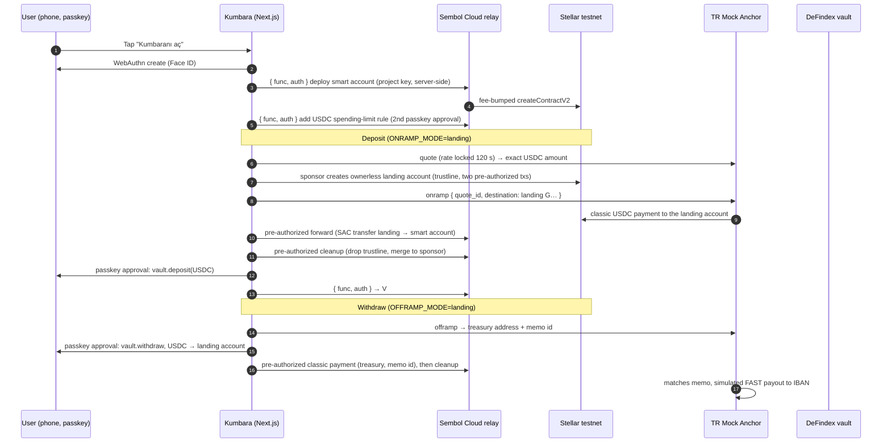

# Kumbara architecture

Kumbara is a self-custodial USDC piggy bank for Turkish users, built on Stellar. A user opens it with a passkey and gets an OpenZeppelin smart account; Turkish lira goes in and out through a regulated anchor; the USDC sits in a DeFindex vault. Kumbara never holds fiat, keys or USDC.

## How it works

## The stack, in plain English

- **Wallet**: every user is an OpenZeppelin smart account contract on Stellar whose only signer is the passkey on their phone. `@sembol/passkey-react` handles creation, signing, recovery (backup passkeys, any-of-N signers) and the spending-limit policy UI. Kumbara adds no wallet code of its own.
- **Fees**: the browser never holds XLM. Signed authorization entries go to Kumbara's own `/api/relay` route, which attaches the project key and forwards to Sembol Cloud, a relay in front of an unmodified OpenZeppelin Relayer running the Channels plugin. Until Sembol Cloud is deployed the same route can point at the hosted OpenZeppelin Channels service. If the relay is down, the app says so; it never asks the user for XLM.
- **Lira in and out**: TR Mock Anchor is the regulated party. Its Partner API (server-side key) issues an IBAN and a reference code, converts TRY to testnet USDC at a Reflector-sourced rate with a 50 bps spread, and pays out simulated FAST transfers. The USDC issuer and SEP endpoints are read from its `stellar.toml`, never hardcoded.
- **Landing accounts**: the anchor only pays and watches classic G… addresses, so each deposit and withdrawal passes through a throwaway classic account that nobody controls (see the threat model). It exists for about a minute and its reserves return to the sponsor.
- **Yield**: USDC is deposited into a DeFindex vault. On testnet the vault (`CBUEZTX2…5ZNV`) was deployed through the DeFindex factory for Circle's testnet USDC and has **no active strategy**, so no yield accrues there; on mainnet the app points at DeFindex's USDC vault with Blend strategies. Kumbara writes no vault code.
- **Price**: the TRY equivalent shown on the Savings screen comes from Reflector's foreign-exchange oracle on Stellar mainnet (USD/TRY, 14 decimals, 5-minute resolution), with the anchor's mid rate as fallback.
- **Booth counter**: `/api/relay` records project id, timestamp, network, booth ref and the transaction hash for every relayed submission. Nothing else is tracked.

## Design tradeoffs

**Per-user contract wallets over pooled custody.** A pooled account would make the anchor integration trivial (one G… address) and remove the landing-account machinery. It would also make Kumbara a custodian of user USDC, which is exactly what the regulatory note in the README says it is not. Contract wallets cost one deployment per user (paid by the relay) and the landing-account detour; they keep the user's funds under the user's passkey alone.

**Anchor-hosted rails over an own ramp.** Building a TRY ramp means banking, KYC and licensing. The anchor is the licensed party; Kumbara only drives its API and shows the IBAN pattern Turkish users already know. The price is dependence on the anchor's constraints (classic-only delivery, memo-based attribution), absorbed by the landing accounts.

**Prepaid fee budgets over metered billing.** Users never see XLM, so someone pays. A project-scoped relay budget (Sembol Cloud) keeps that predictable and keeps the relay key off the client. The relay validates what it will pay for; a compromised page cannot drain more than the budget.

**Vault choice delegated to DeFindex.** Kumbara picks a vault id from configuration and calls the vault's public `deposit`/`withdraw`/`balance`; strategy selection, rebalancing and fees are DeFindex's. The Savings screen states that yield is possible, never a rate, and says plainly when the testnet vault has no strategy.

**Spending limit as a per-transaction cap.** The OpenZeppelin spending-limit policy caps the USDC moved within a rolling window and has no destination allowlist, so the vault and the landing accounts cannot be exempted. Kumbara installs it on a USDC-scoped rule with a one-ledger window, which acts as a 1,000 USDC per-transaction cap. It applies to vault deposits too (verified on testnet: the policy's spent counter rose for a vault deposit). Users can raise or lower it on the security page.

## Threat model

### What the relay can and cannot do

The relay only sees signed authorization entries (or, for landing accounts, fully signed pre-authorized envelopes). It supplies a channel account as transaction source and pays the fee. It **cannot** forge a user signature, change what a signed entry authorizes, or move USDC: a smart account's `require_auth` binds the passkey signature to the exact invocation and to the context rules it was signed under. What it **can** do: refuse service (denial of service, mitigated by failing loudly and by the pre-authorized transactions having no expiry, so they can be resubmitted later), spend its own XLM on fees, and see metadata (which contract was called, when). The project key lives only in the server route; the browser talks to `/api/relay` on the same origin.

### What a compromised anchor could do

The anchor holds TRY balances and the USDC treasury; if it were compromised it could refuse or delay payouts, pay wrong amounts, or misprice quotes. It cannot touch USDC already in a smart account or the vault, and it cannot spend from a landing account (whose only transactions are pre-authorized). Kumbara guards against wrong amounts by creating on-ramps with a locked quote and refusing to forward if the paid amount differs from the quote, and it shows every anchor status, including failed and refunded.

### Landing accounts

A landing account is a classic Stellar account created by Kumbara's sponsor key for exactly one deposit or withdrawal:

- **Who can move the funds: nobody.** After setup the account has three signers: its master key with weight 1 and two pre-authorized transaction hashes with weight 1 each, and all thresholds are 2. A pre-authorized signer alone or the master key alone reaches weight 1; only the exact pre-agreed envelope (pre-authorized hash plus the master co-signature attached at setup) reaches 2. The master key exists only in memory during setup and is discarded. Even if it leaked, it could not authorize any transaction that was not already pre-authorized, and thresholds cannot be changed (that needs weight 2). The forward transaction sends the exact quoted USDC amount to the user's smart account (deposit) or to the anchor's treasury with the anchor's memo (withdrawal); the cleanup transaction drops the trustline and merges the account into the sponsor. Neither has a time bound, so a relay outage delays them but cannot invalidate them.
- **Amount mismatch.** The forward amount is fixed from the anchor's quote. If the anchor paid a different amount the forward would fail (`insufficient balance`) or leave dust, so Kumbara checks the anchor's `amount_usdc` against the quote before submitting and, on mismatch, stops and surfaces the order id; the USDC stays in the landing account, which nobody can drain, until the anchor corrects the payment. On testnet the paid amount equaled the quote in every one of the recorded runs (see `anchor-notes.md`).
- **Reserve recovery.** The sponsor creates the account with zero XLM and sponsored reserves (base reserve, trustline, two signers: 2.5 XLM on the current base reserve). The cleanup merge releases every sponsored entry, so the sponsor's net cost per deposit is the fee of its two setup transactions (900 stroops); the relay pays the two pre-authorized transactions (about 15,000 stroops for the Soroban forward after refunds, 300 for the cleanup).
- **Replay.** Each pre-authorized transaction is bound to the landing account's next sequence numbers and is removed as a signer once applied; it cannot run twice.

### Replay and limit enforcement on the smart account

Every passkey signature covers a nonce and an expiration ledger inside the authorization entry, so an entry cannot be replayed. The spending-limit policy is evaluated on-chain for every USDC `transfer` the account authorizes, including the vault's inner transfer during `deposit`; the auth digest binds the context rule ids, so a signature cannot be re-targeted at a rule without the policy. Limits are per account and per rule; the relay cannot bypass them because it never signs for the account.

## Production gap (from the anchor's own "Mainnet: what to expect")

The list below is the anchor's "What will likely change" section, reproduced verbatim so the seams are visible in this codebase.

1 · Authentication: from a static key to OAuth2. The sandbox's X-API-Key is the training-wheels version. Production Turkish partner APIs typically use OAuth2 client-credentials: you hold a client_id + client_secret, exchange them at a token endpoint for a short-lived JWT plus a refresh token, and send the JWT as Authorization: Bearer. Expect: Granular scopes — read scopes separated from create/confirm scopes; request only what you need. An IP allowlist — your calls must originate from a static egress IP you register with the anchor. Home connections and default cloud egress IPs don't qualify. Token expiry mid-flow — refresh handling is your problem, not an edge case.

2 · The ramp may decompose into deposit + swap + withdrawal. This sandbox gives you an atomic POST /v1/onramps. A production anchor is often an exchange underneath, and its API shows it: the TRY you deposit becomes a TL-stablecoin balance, conversion is an explicit swap (quote → confirm, with a TTL and a commission in the from-asset — that's what this sandbox's flat spread stands in for), and the on-chain leg is a separate crypto withdrawal. Budget for composing two to four calls, each with its own status machine, where the sandbox has one.

3 · Compliance fields become real. Travel rule: originator information on crypto deposits (name, address ownership, VASP fields). Purpose & source of funds on stablecoin withdrawals, plus free-text descriptions with length rules. Pre-registration: withdrawal addresses and bank accounts often must be saved (and verified) before the API will use them — "send to any address" is a sandbox luxury. 2FA / verification codes on sensitive writes; KYC tiers that set your limits; compliance rejections as first-class API errors.

4 · Fiat deposits may be observe-only. There is often no API call to initiate a TRY deposit: the customer pays through the bank rail and your integration observes the deposit appearing in a fiat-transactions list. The sandbox's simulate-endpoint disappears; the watching, matching and unmatched-handling remain.

5 · Notifications may be a websocket. Some anchors stream quotes and status changes over Socket.IO-style websockets (authenticated with the same bearer token) instead of — or in addition to — webhooks. Keep your status handling transport-agnostic; polling the transaction endpoints always works and doubles as your reconciliation.

6 · Money details. Mainnet USDC issuer is GA5ZSEJYB37JRC5AVCIA5MOP4RHTM335X2KGX3IHOJAPP5RE34K4KZVN — trustlines, treasury addresses and explorers all change; never hardcode the testnet issuer. Live pricing: quotes come from a real book, expire faster, and move with liquidity; commissions may be tiered by volume. Fees appear as line items: network withdrawal fees, swap commission, sometimes fixed payout fees — not one blended spread. Limits: per-transaction and per-tier minimums/maximums on every leg.

7 · Operations. Rate limits (HTTP 429) with backoff; idempotency discipline on writes. Separate sandbox and production environments with separate credentials — never assume one implies the other. Real incident behaviour: maintenance windows (503), partial outages, delayed settlements. Your state machine, not your happy path, is the product.

Where those seams live in Kumbara: anchor auth in one module (`lib/anchor.server.ts`), conversion behind quote/execute functions, the ramp modeled as a pipeline with per-leg status, the asset issuer and endpoints discovered from the toml, and pre-registered withdrawal addresses handled by the landing-account design (the anchor only ever sees classic addresses that Kumbara registers per transaction).
